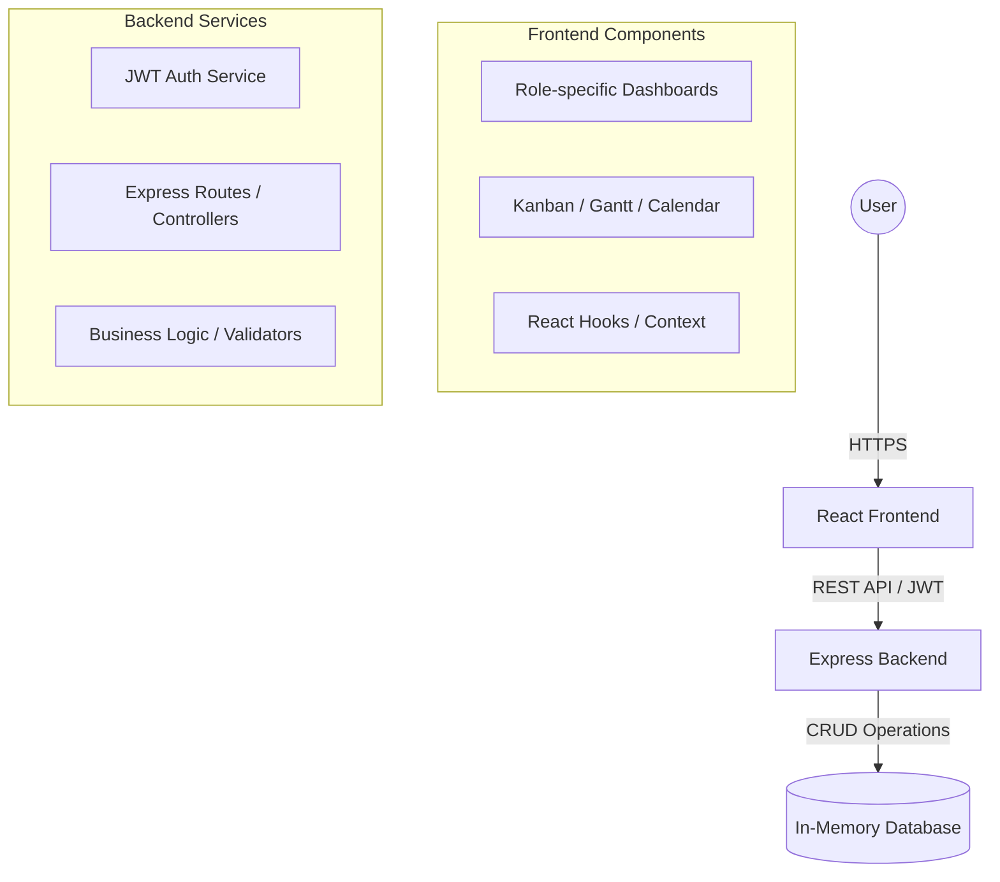

# System Architecture: Tender Manager

## Overview
Tender Manager follows a classic Client-Server architecture designed for scalability, ease of maintenance, and clear separation of concerns.

## 1. Frontend Architecture
- **Framework**: [React](https://reactjs.org/) with [TypeScript](https://www.typescriptlang.org/) for type safety.
- **Build Tool**: [Vite](https://vitejs.dev/) for high-performance development and bundling.
- **Styling**: [Tailwind CSS](https://tailwindcss.com/) for utility-first responsive design.
- **Icons**: [Lucide React](https://lucide.dev/) for consistent UI iconography.
- **Routing**: [React Router](https://reactrouter.com/) for single-page application navigation.
- **Data Visualization**: [Recharts](https://recharts.org/) for dashboard analytics and charts.
- **Component Design**: Modular architecture with reusable components for UI elements like status pills, panels, and data tables.

## 2. Backend Architecture
- **Runtime**: [Node.js](https://nodejs.org/).
- **Web Framework**: [Express](https://expressjs.com/) for handling RESTful API endpoints.
- **Authentication**: [jsonwebtoken (JWT)](https://github.com/auth0/node-jsonwebtoken) for stateless session management and security.
- **Middlewares**:
    - `auth`: Validates JWT tokens and injects user context.
    - `requireRole`: Enforces Role-Based Access Control (RBAC) at the route level.

## 3. Data Model (Mock DB)
The current implementation utilizes a structured JavaScript object as an in-memory database (`backend/db.ts`). This allows for rapid prototyping while maintaining a schema that is easily migratable to a persistent solution like MongoDB or PostgreSQL.

### Core Collections:
- **users**: Stores user profiles, credentials, and roles.
- **projects**: Contains project metadata, status, and stakeholder links.
- **teams**: Mapping of project IDs to Team Leads and Members.
- **tasks**: Granular units of work assigned to members within a project.
- **activityFeed/notifications**: Transactional logs for system events.
- **experienceHistory**: Immutable record of user project completions.

## 4. Security
- **JWT Protection**: All sensitive API routes are protected.
- **RBAC Enforcement**: Server-side validation of user roles before allowing critical operations (e.g., project creation, lead assignment).
- **Frontend Guardrails**: Conditional rendering based on user roles and permissions provided in the JWT payload.

## 5. Development Workflow
- **Frontend/Backend Separation**: The frontend communicates with the backend via proxy settings in `vite.config.ts`, ensuring a seamless development experience.
- **Environment Variables**: configuration for secrets like `JWT_SECRET` via environment variables.
